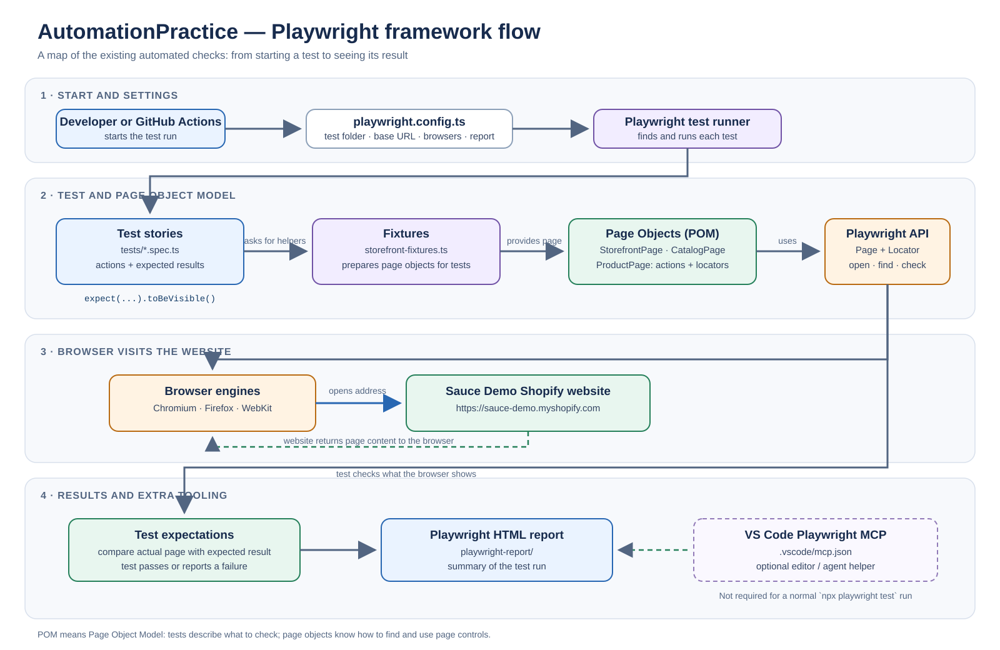
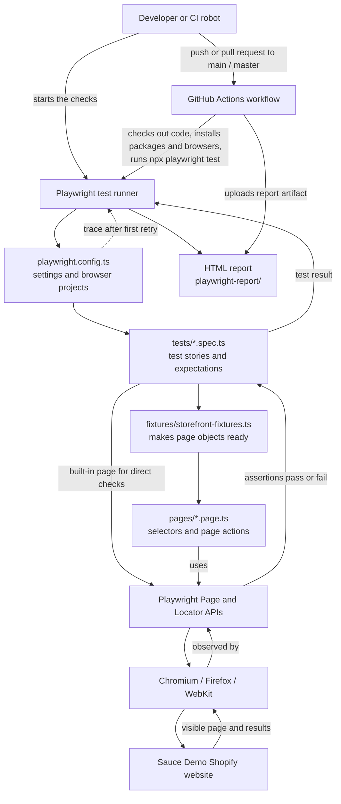
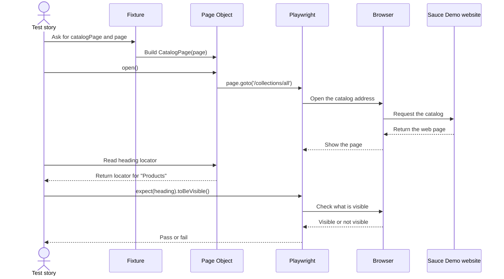

# Playwright Architecture and Page Object Model (POM)

## First, what is this project?

Think of a person checking a toy shop:

- The **shop** is the website: `https://sauce-demo.myshopify.com`.
- The **checker** is this Playwright project. It opens the website and checks that it behaves as expected.
- The project does **not** contain the shop's application code. It contains the automated checks for the shop.

The diagrams below show how the checker is organized and how one check travels through it.

## Architecture diagram



Open [the SVG diagram](./automation-framework-flow.svg) directly to zoom in.



### The boxes in plain language

| Part | What it means |
|---|---|
| **Developer or CI robot** | A person can start tests on a computer. CI is a robot that can start them automatically for pushes and pull requests targeting `main` or `master`. |
| **Playwright test runner** | The traffic controller. It finds test files, starts each test, manages browser sessions and tells us which tests passed. |
| **`playwright.config.ts`** | The rule book: where tests live, which browsers to use, the website's base address, and what reports/traces to collect. |
| **Test spec (`*.spec.ts`)** | A test story: “open the catalog, then check that products are shown.” It contains the actions and the expected answers. |
| **Fixture** | A helper that prepares reusable things for a test. Here it creates the page-object instances using Playwright's browser `page`. |
| **Page Object** | A small helper representing one kind of website page. It keeps useful selectors and actions in one place. |
| **Playwright `Page` / `Locator`** | `Page` is like the open browser tab. A `Locator` is a recipe for finding something on that page, such as a button. |
| **Browser engine** | The browser doing the work. This project runs Chromium, Firefox and WebKit. |
| **Website** | The real, external Sauce Demo storefront that the browser visits. It is not started from this repository. |
| **Expectation / assertion** | A check that compares what happened with what should happen, such as “the heading is visible.” |
| **HTML report** | A readable summary of the test results. The workflow uploads it so people can inspect the run. |
| **Trace** | A recording of browser activity that helps investigate a retry after a failure. The configuration collects it on the first retry. |

## The POM flow: one test, step by step

POM means **Page Object Model**. Imagine giving the checker a simple set of labeled buttons instead of asking it to remember every tiny detail of the shop. The page object holds the instructions for finding and using controls on a page; the test says what the shopper wants to do and what should be true afterward.



### What happens in order?

1. **The runner finds a test.** For example, it finds a test under `tests/`.
2. **Playwright provides a `page`.** This is the test's browser tab.
3. **The fixture prepares page objects.** It gives the same `page` to the `CatalogPage`, `ProductPage` and `StorefrontPage` helpers.
4. **The test asks for an action.** For example, `catalogPage.open()` means “go to the catalog.”
5. **The page object performs the page-specific action.** `CatalogPage.open()` uses `page.goto('/collections/all')`. Playwright combines that path with the configured base URL.
6. **The browser visits the real website.** The site sends back its web page.
7. **The test checks the result.** An expectation such as `expect(catalogPage.heading).toBeVisible()` checks that the page is right.
8. **The runner records the result.** It reports a pass or explains a failure.

## Where to find things in this repository

| Location | Job |
|---|---|
| [`playwright.config.ts`](../playwright.config.ts) | Sets `tests` as the test directory, uses `https://sauce-demo.myshopify.com` as the base URL, and defines Chromium, Firefox and WebKit projects. |
| [`fixtures/storefront-fixtures.ts`](../fixtures/storefront-fixtures.ts) | Extends Playwright's `test` with `storefrontPage`, `catalogPage` and `productPage` fixtures, and exports `expect`. |
| [`pages/storefront.page.ts`](../pages/storefront.page.ts) | Home/storefront locators and actions such as opening the home page, catalog, blog and About Us page. |
| [`pages/catalog.page.ts`](../pages/catalog.page.ts) | Catalog heading, navigation to all products and a helper to find a product link by name. |
| [`pages/product.page.ts`](../pages/product.page.ts) | Product-page navigation, product heading, price, Add to Cart and Sold Out locators. |
| [`tests/storefront-home-navigation.spec.ts`](../tests/storefront-home-navigation.spec.ts) | Checks the home page and follows primary navigation. |
| [`tests/storefront-catalog-products.spec.ts`](../tests/storefront-catalog-products.spec.ts) | Checks catalog products, prices and sold-out labels, then follows catalog/product navigation. |
| [`tests/storefront-product-detail.spec.ts`](../tests/storefront-product-detail.spec.ts) | Checks available and sold-out product detail pages. |
| [`tests/storefront-blog-navigation.spec.ts`](../tests/storefront-blog-navigation.spec.ts) | Checks the blog and opens an article. |
| [`tests/storefront-about-page.spec.ts`](../tests/storefront-about-page.spec.ts) | Checks the About Us page content. |
| [`tests/example.spec.ts`](../tests/example.spec.ts) | Playwright's standalone example tests; these visit `playwright.dev` directly and do not use the storefront page objects. |
| [`tests/seed.spec.ts`](../tests/seed.spec.ts) | Empty seed-test placeholder; it currently does not perform a check. |
| [`.github/workflows/playwright.yml`](../.github/workflows/playwright.yml) | GitHub Actions recipe: installs dependencies and browsers, runs the suite, and saves the HTML report as an artifact. |
| [`.vscode/mcp.json`](../.vscode/mcp.json) | Configures the Playwright test MCP server for editor/agent workflows. It is a development helper, not a layer needed by a normal Playwright test run. |

The storefront tests usually use page objects for actions and key locators. They also use Playwright's `page` directly for checks that are specific to one test, such as checking the page URL or an individual heading. This is normal: POM is a way to organize repeated page behavior, not a rule that every single line must be hidden in a page object.

## A tiny example from this project

In `tests/storefront-home-navigation.spec.ts`, the test asks `storefrontPage` to open the home page, then checks the page title and visible links. The fixture creates `storefrontPage`; `StorefrontPage.openHome()` navigates to `/`; and the test uses `expect` to check that the expected title and links appear.

Think of it this way:

- **Test:** “Please go to the shop and check the welcome sign.”
- **Page Object:** “I know where the shop door and welcome sign are.”
- **Playwright:** “I will open the door and look.”
- **Expectation:** “The welcome sign is here, so the check passes.”

## How to run the checks

Install packages and browser binaries once on a new machine:

```powershell
npm ci
npx playwright install
```

Run all tests in all configured browsers:

```powershell
npx playwright test
```

Run only Chromium:

```powershell
npx playwright test --project=chromium
```

Open the most recent HTML report:

```powershell
npx playwright show-report
```

This project's `package.json` does not define npm scripts yet, so use the `npx playwright ...` commands above rather than `npm test`.

## A few useful beginner words

- **Automation:** Asking a computer to repeat a task for us.
- **Test case:** One small story about what the website should do.
- **Selector / locator:** A way to point at something on a web page, preferably by its accessible name or role (for example, a link named “Catalog”).
- **Browser project:** The same tests configured to run with a particular browser, such as Firefox.
- **Base URL:** The common beginning of an address. With this project's configured base, `page.goto('/')` goes to the storefront home page.
- **Pass:** The result matched what the test expected.
- **Fail:** The result did not match, or the browser could not complete the action. A failure is a clue to investigate; it does not automatically mean the website is broken.
